## 目次

- [必要な部品，ツール](#必要なもの)
  - [基板](#基板)
  - [3Dプリンタ造形部品](#3dプリンタ造形部品)
  - [実装する部品](#実装する部品)
  - [使用する部品](#使用する部品)
  - [工具](#工具)

- [本体の作成](#本体の作成)
  - [ケーブル加工](#ケーブル加工)
  - [3Dプリント造形部品の追加加工](#3dプリント造形部品の追加加工)
  - [基板のはんだ付け](#基板のはんだ付け)
    - [センサモジュール基板](#センサモジュール基板)
    - [メイン基板](#メイン基板)
    - [サイドキーパッド基板](#サイドキーパッド基板)
    - [親指モジュール基板](#親指モジュール基板)
    - [OLEDモジュール基板](#oledモジュール基板)
    - [追加キーパッドモジュール基板](#追加キーパッドモジュール基板)
    - [メイン基板とサイドキーパッド基板の配線](#メイン基板とサイドキーパッド基板の配線)
  - [組み立て](#組み立て)

## 必要なもの
### 基板
| 名前 | 数 | データへのリンク |
|:-|:-|:-|
| メイン基板 | 1 | |
| センサモジュール基板 | 1 | |
| サイドキーパッド基板 | 1 | |
| OLEDモジュール基板 | 1 | |
| 親指モジュール基板 | 1 | |
| 追加キーパッドモジュール基板 | 1 | |

### 3Dプリンタ造形部品
| 名前 | 数 | ファイル名 |
|:-|:-|:-|
| 本体底面部 | 1 | bottom.step |
| 本体カバー | 1 | body_cover.step |
| debugカバー | 1 | debug_cover.step |
| OLEDモジュールカバー | 1 | OLED_cover.step |
| 親指モジュールカバー | 1 | SW_cover.step |
| ボール保持部 | 1 | ball_holder.step |
| ボール保持部カバー | 1 | ball_holder_cover.step |
| 追加キーパッドモジュール底面部 | 1 |  side_bottom.step |
| 追加キーパッドモジュールカバー | 1 | side_cover.step |
| 親指部キーキャップ1 | 1 | thumb_keycap1.step |
| 親指部キーキャップ2 | 1 | thumb_keycap1.step |
| ジョイント | 2 | jount.step |
| (はんだ付け用治具1) | 1 | はんだ付け用治具1.step |
| (はんだ付け用治具2) | 1 | はんだ付け用治具2.step |

### 実装する部品
| 名前 | 概要 | 数 | 主な調達先 |
|:-|:-|:-|:-|
| PMW3360 | イメージセンサ | 2 |Aliexpress|
| 1n4148w | 表面実装ダイオード | 11 |秋月|
| sk6812MINI-E | マイコン内蔵フルカラーLED | 5 |秋月|
| Kailh Swich socket(MX)| CherryMXスイッチのソケット | 9 |遊舎工房|
| Kailh Swich socket(Choc) | Choc v1スイッチのソケット | 2 |遊舎工房|
| OLED | 128x32pixcelのSSD1306登載OLEDモジュール| 1 |遊舎工房|
| SKRPABE010 | 表面実装スイッチ | 3 |秋月|
| S6B-PH-KL | PHコネクタ ベース付ポスト(サイド型)6極 | 5 |千石電商|
| S8B-PH-KL | PHコネクタ ベース付ポスト(サイド型)8極 | 1 |千石電商|
| B6B-PH-KL | PHコネクタ ベース付ポスト(トップ型)6極 | 1or2 |秋月|
| SKS-01 | ジャンパワイヤ(2.54mm) | 6 |Amazon|
| ピンヘッダ | ハウジング高さ2.5mm，2.54mmピッチ，4ピン | 1 |(秋月)|

ピンヘッダは多くの場合，OLEDモジュールに付属しています．

### ケーブル
| 名前 | 概要 | 数 | 主な調達先 |
|:-|:-|:-:|:-:|
| PHR-6 | PHコネクタ　ハウジング 6極 | 6 |秋月|
| PHR-8 | PHコネクタ　ハウジング 8極 |  1 |秋月|
| SPH-002T-P0.5L | PHコネクタ コンタクト|  44 |秋月|

### 使用する部品
| 名前 | 概要 | 数 | 主な調達先 |
|:-|:-|:-:|:-:|
| M2インサートナット |3.5mm x 4mm(直径 x 高さ)| 12 |[Amazon](https://www.amazon.co.jp/dp/B09NNPNGB8)||
| M2 4mmネジ || 6 ||
| M2 6mmネジ || 2 ||
| M2 8mmネジ || 1 ||
| M2 10mmネジ || 2 ||
| M2 20mmネジ || 1 ||
| M3 8mmネジ || 4 ||
| M3 ナット || 4 ||
| M3ワッシャ || 4 ||
| 磁石 |直径6mm 厚み2.5mmのもの| 4 | セリア |
| ゴム足 | 直径10mmのもの | 7 |[aitendo](https://www.aitendo.com/product/14406)|

### 工具
ParRotを作成する際に使用した工具を次に示します．
- はんだごて一式
- ピンセット
- ニッパー
- ペンチ
- ワイヤーストリッパ
- 圧着工具  
- 精密ドライバーセット
- ピンバイス
- 接着剤
- 3Dプリンタ

消耗品
- はんだ
- ハンダフラックス
- 接着剤
- マスキングテープ

## 本体の作成
### ケーブル加工

使用するケーブルは次の通りです．

| 番号 | ケーブル本数 | 使用するハウジング | 長さ | 向き |
|:-|:-|:-|:-|:-|
| 1 | 6 | 6P | 13mm | 逆 |
| 2 | 6 | 6P | 25mm | 逆 |
| 3 | 6 | 6P | 30mm | 順 |
| 4 | 5 | 8P | 80mm | ー |

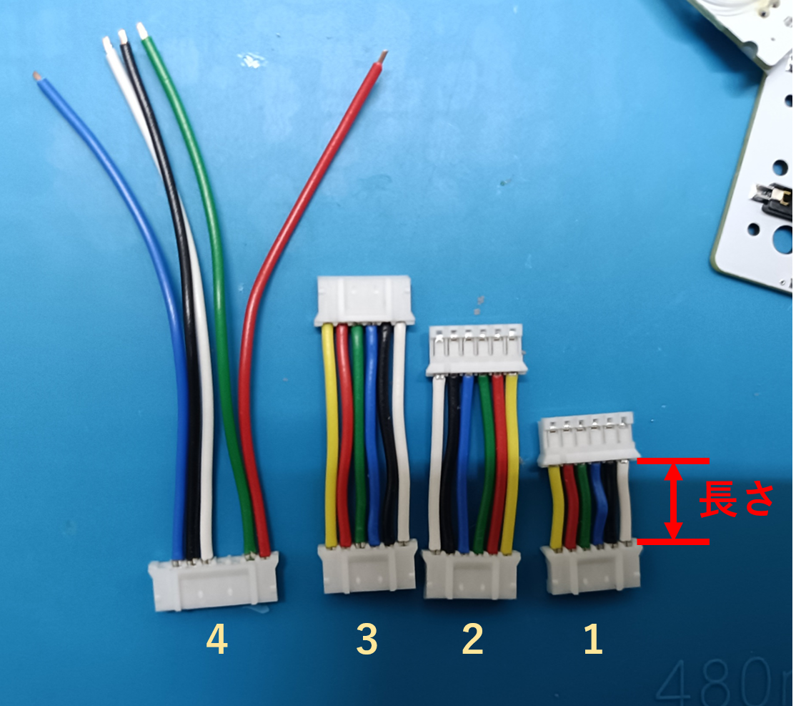
4について
コンタクトが見える側で↓のようにケーブルを差し込んでください．  
|o|o|-|-|o|o|o|-|

### 3Dプリント造形部品の追加加工
事前にサポート材をすべて除去してください．
また，ピンバイス等を用いてネジを通す穴をネジが通るように加工してください．  
1. インサートナットを熱圧入します．
本体底面部においては次の8箇所にインサートナットを圧入します．  
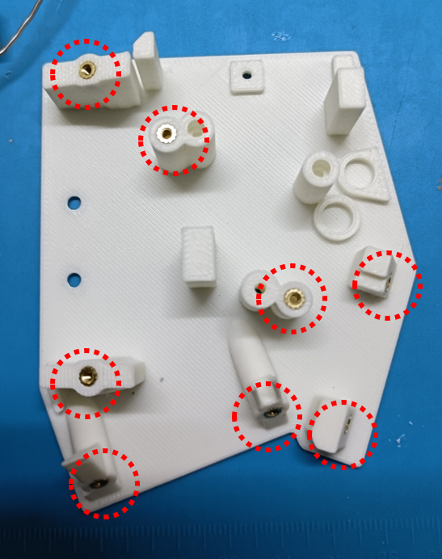  
本体カバーにおいては次の1箇所にインサートナットを圧入します．  
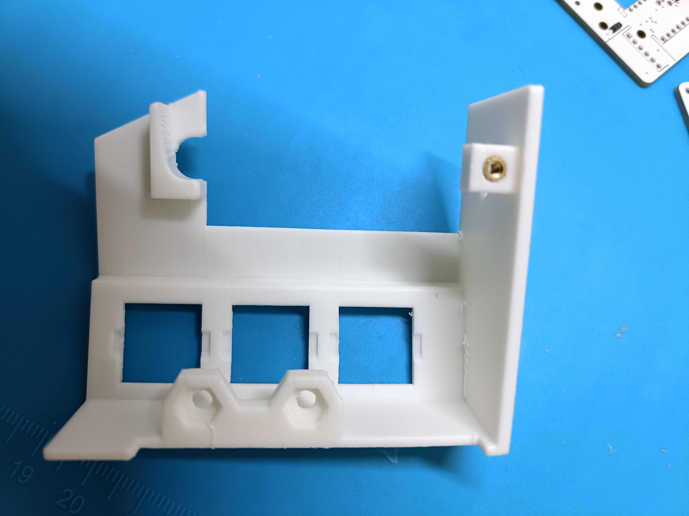  
ボール保持部においては次の2箇所にインサートナットを圧入します．  
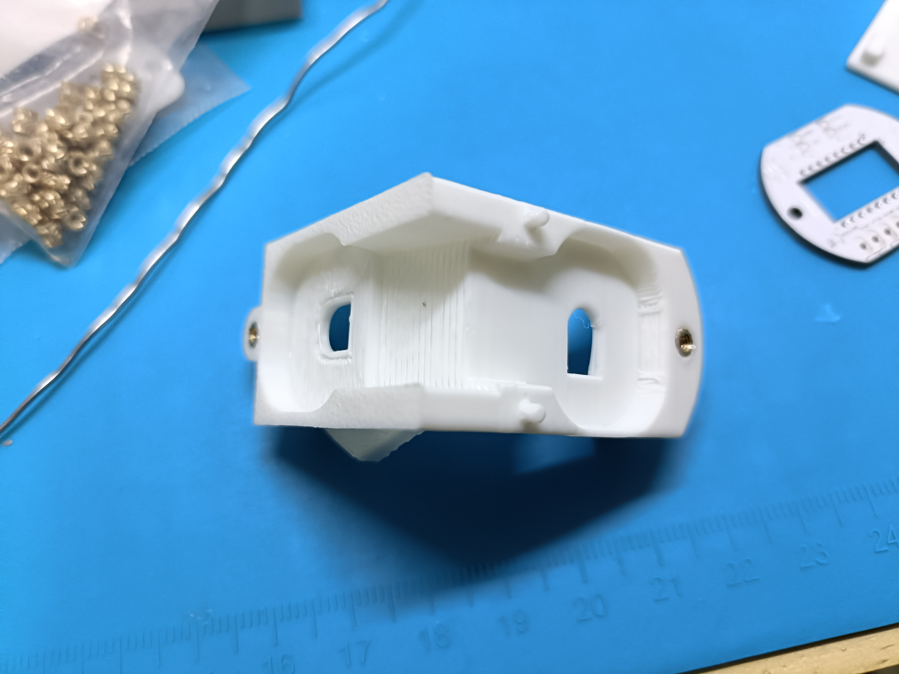  
追加キーパッドモジュール底面部においては次の2箇所にインサートナットを圧入します．  
  
2. 磁石を接着します．
本体底面部において，次の二か所に磁石を接着します．
接着剤を穴の底面と側面に塗布し，磁石を接着します．
この際に，二つの磁石の極が異なるように配置してください．  
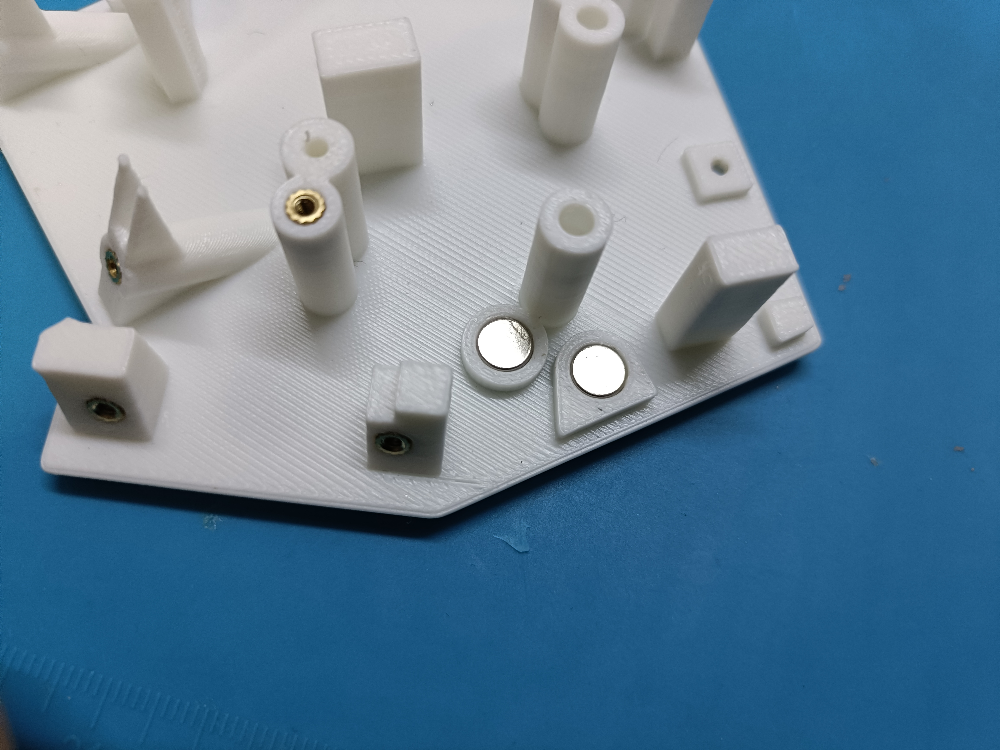  

debugカバーにおいて次の二か所に磁石を接着します．
この際に，本体底面部と引き合う向きで磁石を接着します．
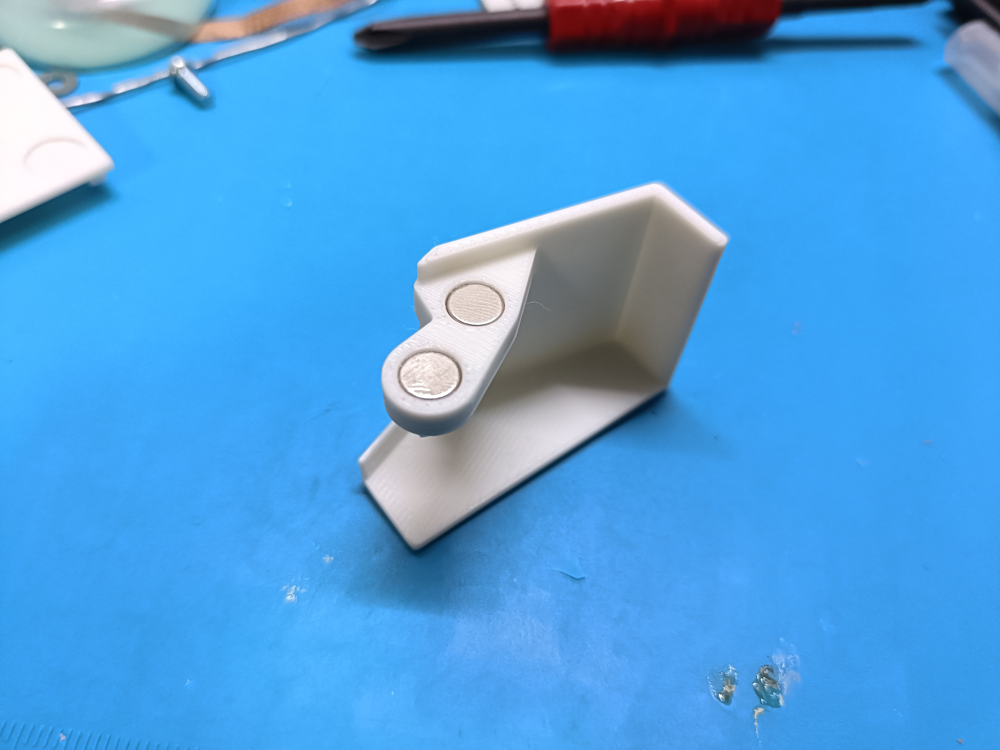

3. ゴム足を取り付けます．
本体底面部，追加キーパッドモジュール底面部にゴム足を接着します．
くぼみがあるところにゴム足を接着します．
ゴム足がはがれることが多かったので接着剤を使用することを推奨します．

### 基板のはんだ付け

#### センサモジュール基板
表面  
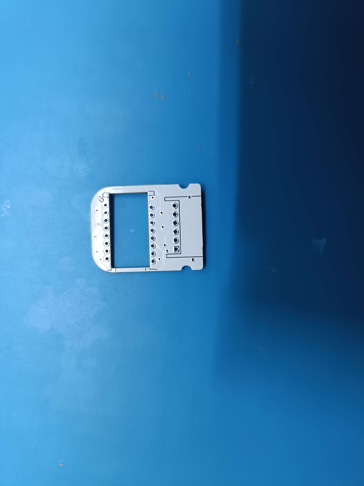  
裏面  
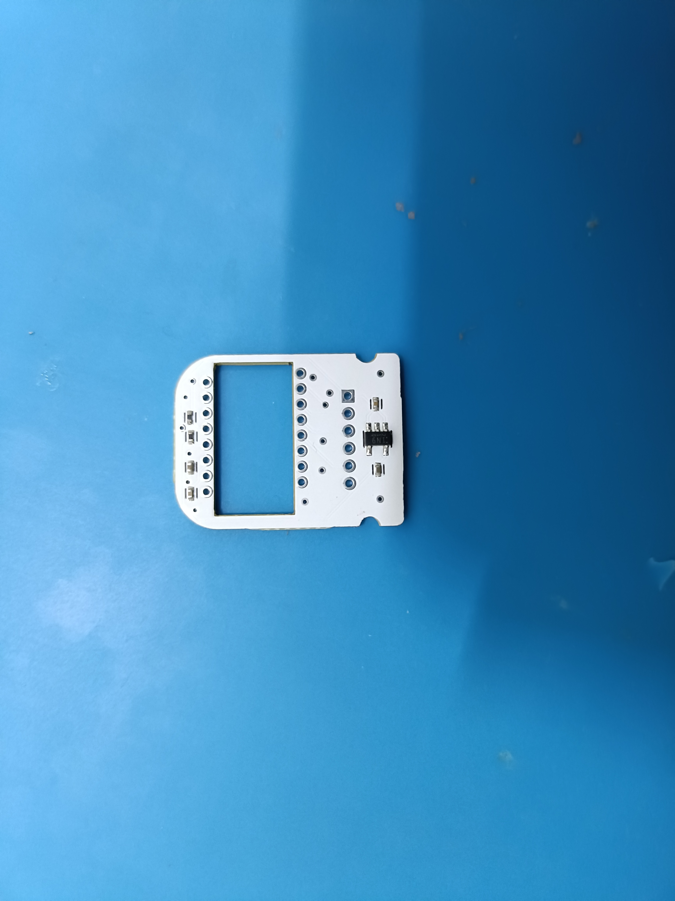  

センサ基板に実装する部品は次の通りです．

| 名前 | 概要 | 数 |
|:-|:-|:-|
| PMW3360 | イメージセンサ | 1 |
| S6B-PH-KL | PHコネクタ ベース付ポスト(サイド型)6極 | 1 |

1. PMW3360の実装
PMW3360を実装します．向きに注意してください．向きを基板裏面のシンボルに合わせます．裏面からセンサを基板に差し込み，表面ではんだ付けします．  
  
  

2. コネクタの実装
次に，コネクタを実装します．
裏面からコネクタを基板に差し込み，表面ではんだ付けします．  
  
3. レンズの取り付け
PMW3360のレンズを取り付けます．  
センサのカプトンテープを剥がし，レンズをセンサに取り付けます．  
  
センサから飛び出ているガイドポスト二か所を半田ごてで溶かし，レンズを固定します．  
  

#### メイン基板
表面  
  
裏面  
  

メイン基板に実装する部品は次の通りです．

| 名前 | 概要 | 数 |
|:-|:-|:-|
| PMW3360 | イメージセンサ | 1 |
| SKRPABE010 | 表面実装スイッチ | 2 |
| S6B-PH-KL | PHコネクタ ベース付ポスト(サイド型)6極 | 2 |
| S8B-PH-KL | PHコネクタ ベース付ポスト(サイド型)8極 | 1 |
| B6B-PH-KL | PHコネクタ ベース付ポスト(トップ型)6極 | 1 or 2 |

1. スイッチの実装
BootスイッチとResetスイッチを実装します．SKRPABE010を表面に実装します．  
  

2. PMW3360の実装
次に，PMW3360を実装します．表面で足をはんだ付けします．向きに注意してください．向きを基板裏面のシンボルに合わせます．裏面からセンサを基板に差し込み，表面ではんだ付けします．  
  
  

3. コネクタの実装
次に，コネクタを実装していきます．  
初めに，センサモジュールとの接続用のコネクタ(S6B-PH-KL)を実装します. 
表面からコネクタを基板に差し込み，裏面ではんだ付けします．  
  
次に，サイドキーパッドとの接続用のコネクタ(S8B-PH-KL)とOLEDモジュールとの接続コネクタ(S6B-PH-KL)を実装します．裏面からコネクタを基板に差し込み，表面ではんだ付けします．  
  
次に，親指モジュールとの接続用のコネクタ(B6B-PH-KL)を実装します．裏面からコネクタを基板に差し込み，表面ではんだ付けします．  
  
任意でデバッグ用のコネクタを実装します．表面からコネクタを基板に差し込み，裏面ではんだ付けします．  
<!--
  
-->

4. レンズの取り付け
センサ基板と同様の手順でPMW3360のレンズを取り付けます．

#### サイドキーパッド基板
表面  
  
裏面  
  

実装する部品は次の通りです．
| 名前 | 概要 | 数 |
|:-|:-|:-|
| Kailh Swich socket(MX) | CherryMXスイッチのソケット | 3 |
| sk6812MINI-E | マイコン内蔵フルカラーLED | 3 |
| 1n4148w | 表面実装ダイオード | 3 |

裏面に部品を実装します．
LED,ダイオード，MXソケットを実装します．LED，ダイオード実装の際には向きに注意してください．図のように基板のシルクに合わせて実装します．  
  
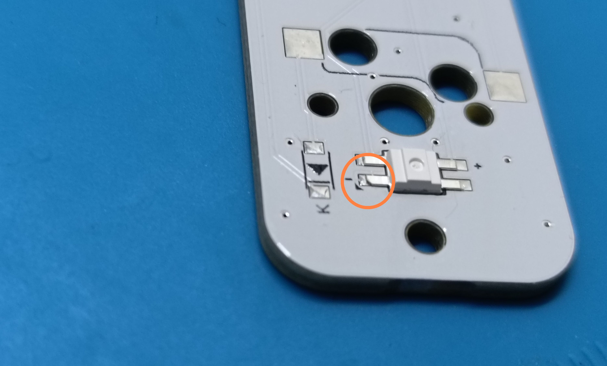  
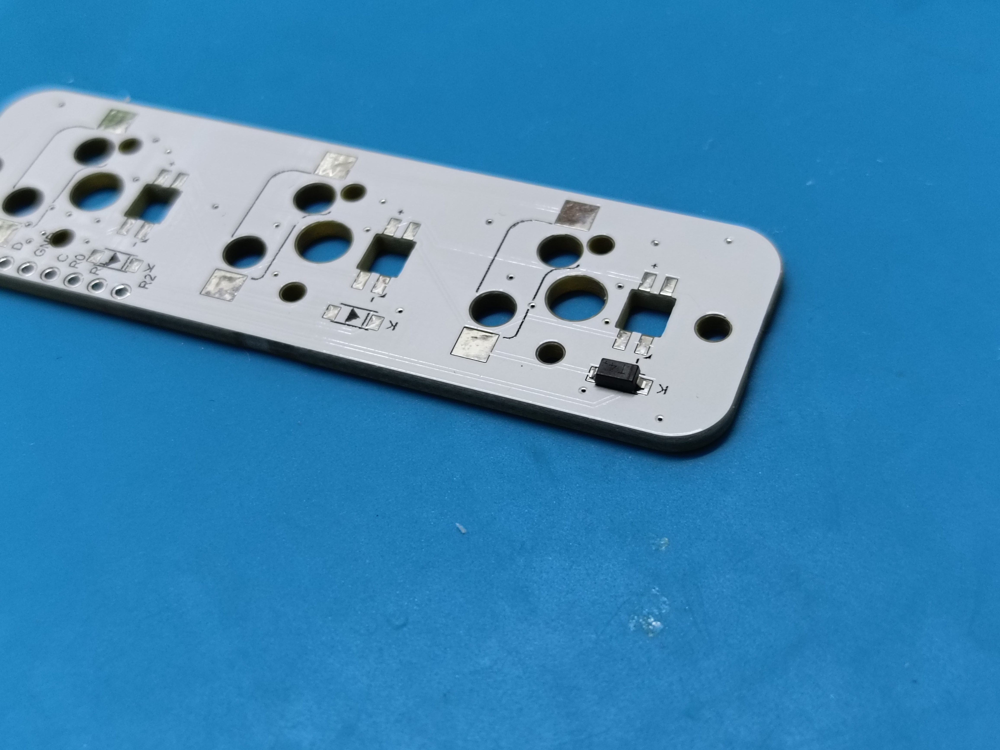  

#### 親指モジュール基板
表面  
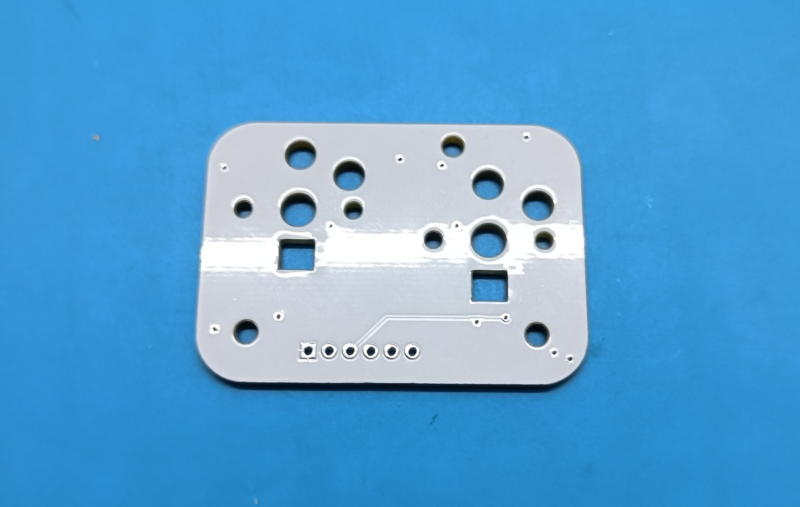  
裏面  
  

実装する部品は次の通りです．
| 名前 | 概要 | 数 |
|:-|:-|:-|
| Kailh Swich socket(Choc) | Kailh_choc v1スイッチのソケット | 2 |
| sk6812MINI-E | マイコン内蔵フルカラーLED | 2 |
| 1n4148w | 表面実装ダイオード | 2 |
| S6B-PH-KL | PHコネクタ ベース付ポスト(サイド型)6極 | 1 |

裏面に部品を実装します．
LED,ダイオード，chocソケットを実装します．chocソケット，LED，ダイオード実装の際には向きに注意してください．
chocソケットにも向きがあります．図のように飛び出している部分が外側を向くように実装します．  
  
  

接続用のコネクタを実装します．裏面からコネクタを基板に差し込み，表面ではんだ付けします．  
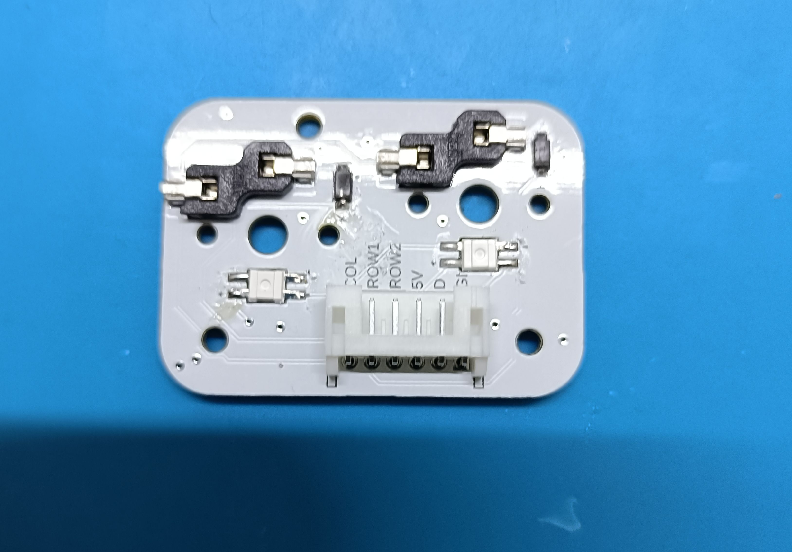  

#### OLEDモジュール基板
表面  
  
裏面  
  

実装する部品は次の通りです．
| 名前 | 概要 | 数 |
|:-|:-|:-|
| SKRPABE010 | 表面実装スイッチ | 1 |
| OLED | 128x32pixcelのSSD1306登載OLEDモジュール| 1 |
| S6B-PH-KL | PHコネクタ ベース付ポスト(サイド型)6極 | 1 |

1. スイッチの実装
表面実装スイッチを表面に実装します．  
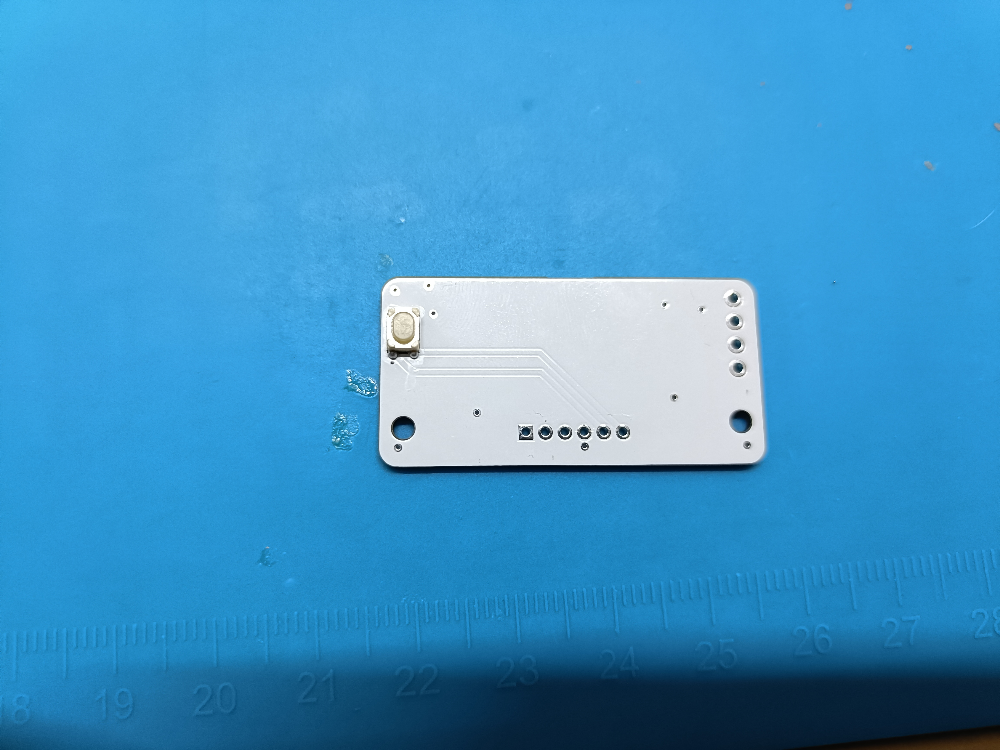  

2. コネクタの実装
次に，コネクタを実装します．裏面からコネクタを基板に差し込み，表面ではんだ付けします．  
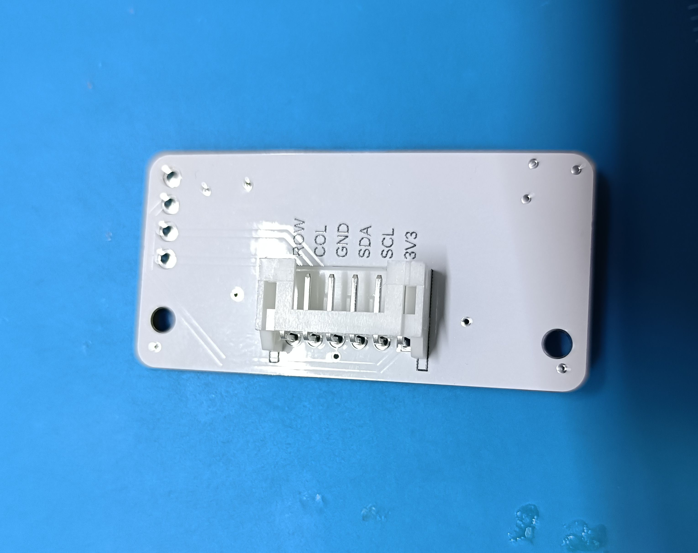  

3. OLEDの実装
次に，OLEDを実装します．  
OLEDにピンヘッダをはんだ付けします．  
  
OLEDを基板に差し込みます．任意で基板の裏側から出ているピンヘッダを切断します．  
基板の裏側からピンヘッダをはんだ付けします．この際に基板のエッジとOLEDのエッジが平行になるように注意してください．大きくゆがんでいると組み立てた際にOLEDの押し込みができなくなる場合があります．  
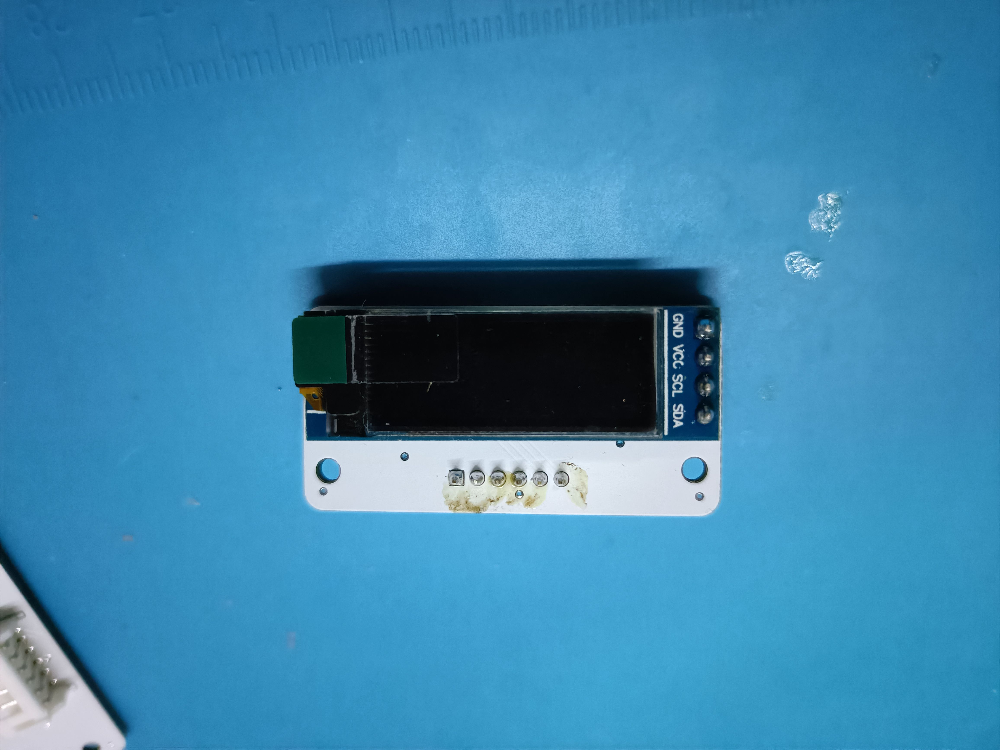  

#### 追加キーパッドモジュール基板
表面  
  
裏面  
  

実装する部品は次の通りです．
| 名前 | 概要 | 数 |
|:-|:-|:-|
|| CherryMXスイッチのソケット | 6 |
| 1n4148w | 表面実装ダイオード | 6 |

1. 表面実装部品の実装
裏面に部品を実装します．
ダイオード，MXソケットを実装します．ダイオード実装の際には向きに注意してください．図のように基板のシルクに合わせて実装します．  
  
  

2. ケーブルの取り付け
ケーブル4をはんだ付けします．ケーブルの向きに注意してください．ケーブルが外側を向きようにします．また，基板を裏面から見た際にハウジングが見える向きにします．  
  

ケーブルを反対側に折り曲げます．  
  

#### メイン基板とサイドキーパッド基板の配線
メイン基板とサイドキーパッド基板を接続します．
本体底面部にメイン基板とサイドキーパッド基板を取り付けます．固定にはM2 4mmネジを4本使用します．  
  
ジャンパワイヤを7本基板表側から差し込みます．  
  
この状態でマスキングテープ等で固定します．  
  
メイン基板とサイドキーパッド基板を外し，はんだ付け用治具1,2に取り付けます．  
  
基板の裏側からジャンパワイヤをはんだ付けします．  
  
余分なジャンパワイヤを切断します．  
  
### 組み立て

追加キーパッドモジュール底面部にジョイントを取り付けます．ねじはM3 8mmネジを使用します．また，ジョイントの上下をM3ワッシャで挟み，M3ナットで締結します．  
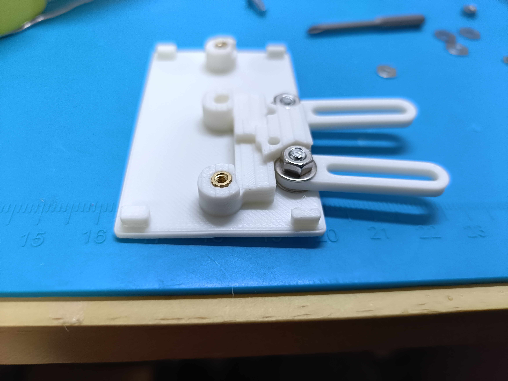  
本体底面部とジョイントを締結します．ねじはM3 8mmネジを使用します．また，ジョイントの上下をM3ワッシャで挟み，M3ナットで締結します．  
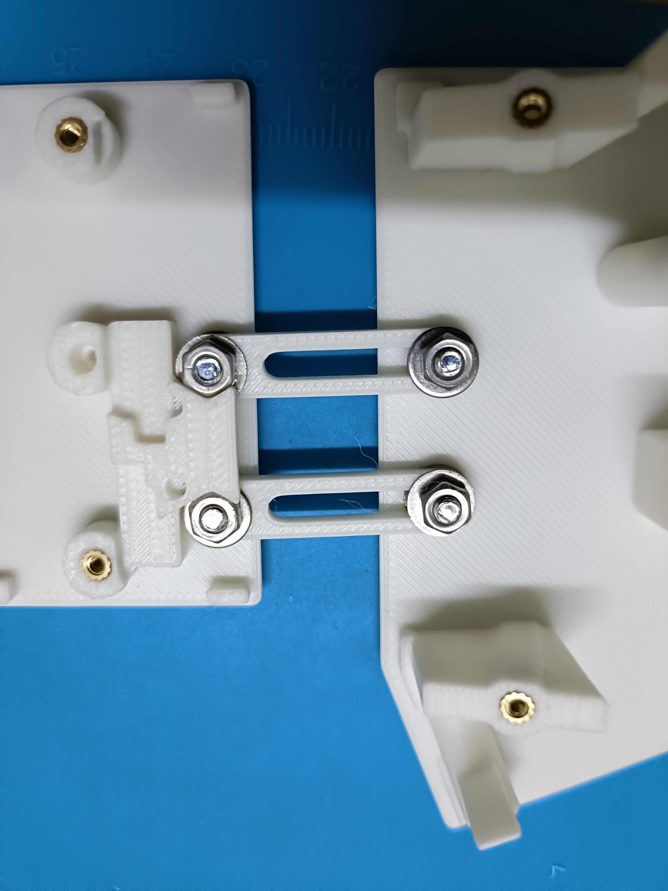　　

基板をケーブルで接続します．  
使用するケーブルは次の通りです．
- メイン基板 - センサモジュール基板  
&rarr;ケーブル1
- メイン基板 - 親指モジュール基板  
&rarr;ケーブル2
- メイン基板 - OLEDモジュール基板  
&rarr;ケーブル3    

また，メイン基板とサイドキーパッド基板の接続も行います．

基板を本体底面部，追加キーパッドモジュール底面部にに取り付けます．
締結にはM2 4mmネジを使用します．締結箇所は次の6箇所です．
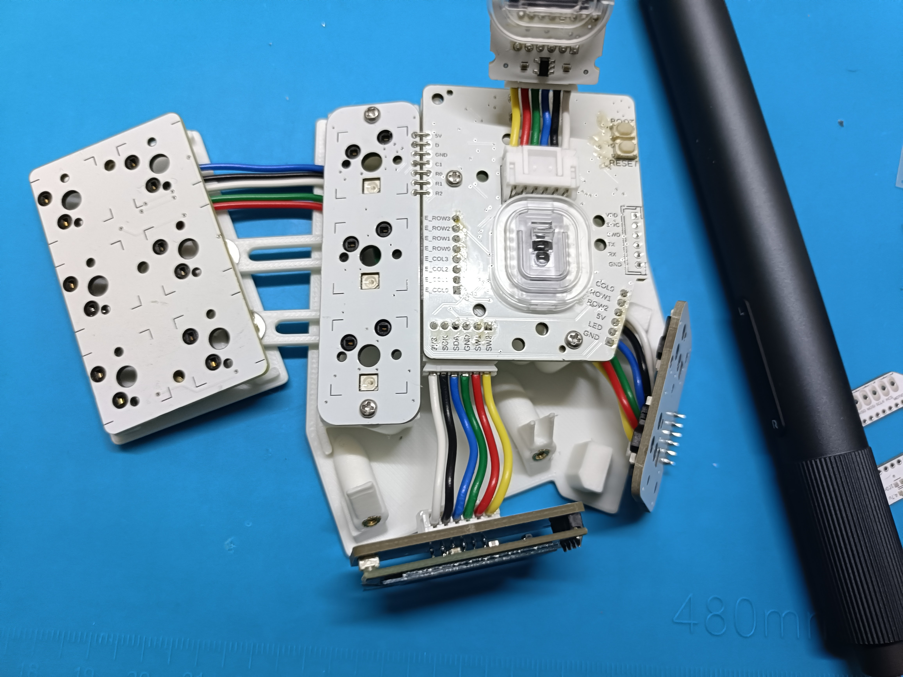

本体カバーを取り付けます．
この際にM3ナットの向きを調整してください．

ボール保持部，ボール保持部カバーを取り付けます．

ねじで締結します．　　

| 番号 | 使用するねじ |
|:-:|:-|
| 1 | M2 8mmネジ |
| 2 | M2 10mmネジ |
| 3 | M2 20mmネジ |

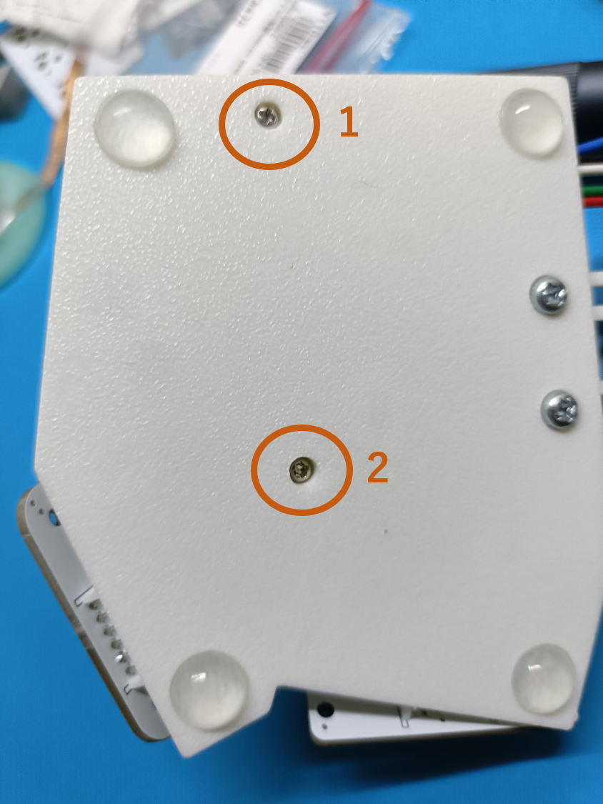  
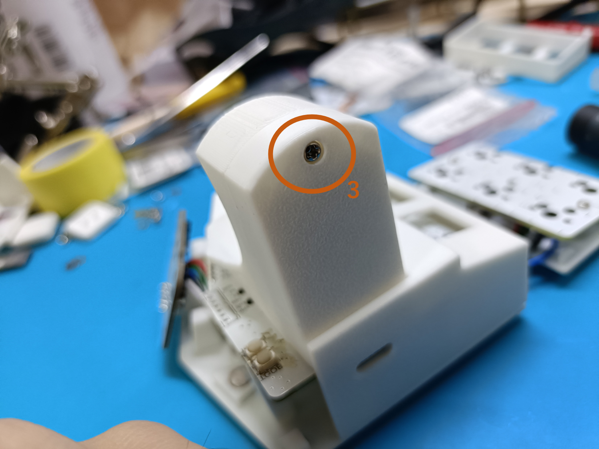  

OLEDモジュールカバーを取り付けます．締結にはM2 8mmネジを使用します．  
  

親指モジュールカバーを取り付けます．締結にはM2 6mmネジを使用します．  
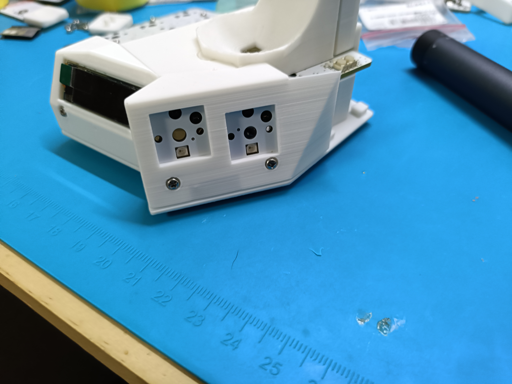  

サイドキーパッドカバーを取り付けます．  
  

キースイッチを取り付けます．  
  

キーキャップを取り付けます．  

