## [目次]

## [必要な部品]

基板
| 名前 | 数 | データへのリンク |
|:-|:-|:-|
| メイン基板 | 1 | |
| センサモジュール基板 | 1 | |
| サイドキーパッド基板 | 1 | |
| OLEDモジュール基板 | 1 | |
| 親指モジュール基板 | 1 | |
| 追加キーパッドモジュール基板 | 1 | |

3Dプリンタ造形部品
| 名前 | 数 | データへのリンク |
|:-|:-|:-|
| 本体底面部 | 1 | |
| 本体カバー | 1 | |
| debugカバー | 1 | |
| OLEDモジュールカバー | 1 | |
| 親指モジュールカバー | 1 | |
| ボール保持部 | 1 | |
| ボール保持部カバー | 1 | |
| 追加キーパッドモジュール底面部 | 1 | |
| 追加キーパッドモジュールカバー | 1 | |
| ジョイント | 2 | |
| (はんだ付け用治具1) | 1 | |
| (はんだ付け用治具2) | 1 | |

実装する部品
| 名前 | 概要 | 数 | 主な調達先 |
|:-|:-|:-|:-|
| PMW3360 | イメージセンサ | 2 |  |
| 1n4148w | 表面実装ダイオード | 11 |  |
| sk6812MINI-E | マイコン内蔵フルカラーLED | 5 | |
|| CherryMXスイッチのソケット | 9 | |
|| Choc v1スイッチのソケット | 2 | |
| OLED | 128x32pixcelのSSD1306登載OLEDモジュール| 1 ||
| SKRPABE010 | 表面実装スイッチ | 3 ||
| S6B-PH-KL | PHコネクタ ベース付ポスト(サイド型)6極 | 5 ||
| S8B-PH-KL | PHコネクタ ベース付ポスト(サイド型)8極 | 1 ||
| B6B-PH-KL | PHコネクタ ベース付ポスト(トップ型)6極 | 1or2 ||
| SKS-01 | ジャンパワイヤ(2.54mm) | 6 ||
| ピンヘッダ | ハウジング高さ2.5mm，2.54mmピッチ，4ピン | 1 ||

ピンヘッダは多くの場合，OLEDモジュールに付属しています．

ケーブル
| 名前 | 概要 | 数 | 主な調達先 |
|:-|:-|:-|:-|
| PHR-6 | PHコネクタ　ハウジング 6極 | 6 ||
| PHR-8 | PHコネクタ　ハウジング 8極 |  1 ||
| SPH-002T-P0.5L | PHコネクタ　コンタクト|  44 ||

使用する部品
| 名前 | 概要 | 数 | 主な調達先 |
|:-|:-|:-|:-|
| M2インサートナット |3.5mm x 4mm(直径 x 高さ)| 12 |https://www.amazon.co.jp/dp/B09NNPNGB8||
| M2 4mmネジ || 6 ||
| M2 6mmネジ || 2 ||
| M2 8mmネジ || 1 ||
| M2 10mmネジ || 2 ||
| M2 20mmネジ || 1 ||
| M3 8mmネジ || 4 ||
| M3 ナット || 4 ||
| M3ワッシャ || 4 ||
| 磁石 || 4 | セリア |
| ゴム足 | 直径mmのもの | 7 ||

## [工具]
ParRotを作成する際に使用した工具を次に示します．
- はんだごて一式
- ピンセット
- ニッパー
- ペンチ
- ワイヤーストリッパ
- 圧着工具  
- 精密ドライバーセット
- ピンバイス
- 接着剤
- 3Dプリンタ

## [使用部品の調達]
### [基板の調達]
基板のgarberファイル用いて任意の基板製造業者に発注してください．
また，メイン基板，センサ基板はJLCPCBで使用できるPCBAデータを用意しています．
## [ケーブル加工]

使用するケーブルは次の通りです．

| 番号 | ケーブル本数 | 使用するハウジング | 長さ | 向き |
|:-|:-|:-|:-|:-|
| 1 | 6 | 6P | 17mm | 逆 |
| 2 | 6 | 6P | 30mm | 逆 |
| 3 | 6 | 6P | 35mm | 順 |
| 4 | 5 | 8P | 80mm | ー |

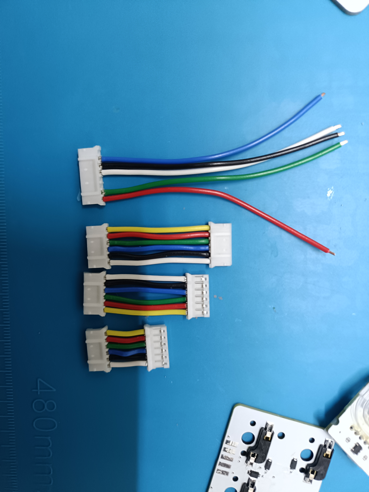
4について
コンタクトが見える側で↓のようにケーブルを差し込んでください．  
|o|o|-|-|o|o|o|-|

## [3Dプリント造形部品の追加加工]
事前にサポート材をすべて除去してください．
ピンバイス等を用いてネジを通す穴をネジが通るように拡張します．
インサートナットを熱圧入します．
本体底面部においては次の8箇所にインサートナットを圧入します．  
  
本体カバーにおいては次の1箇所にインサートナットを圧入します．  
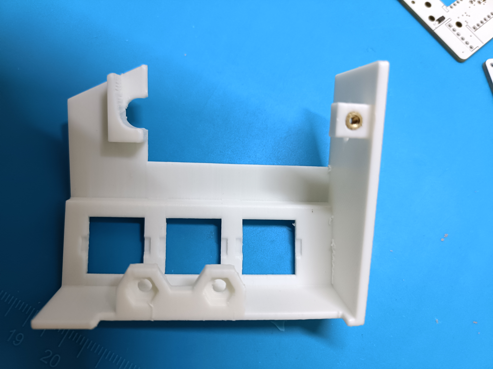  
ボール保持部においては次の2箇所にインサートナットを圧入します．  
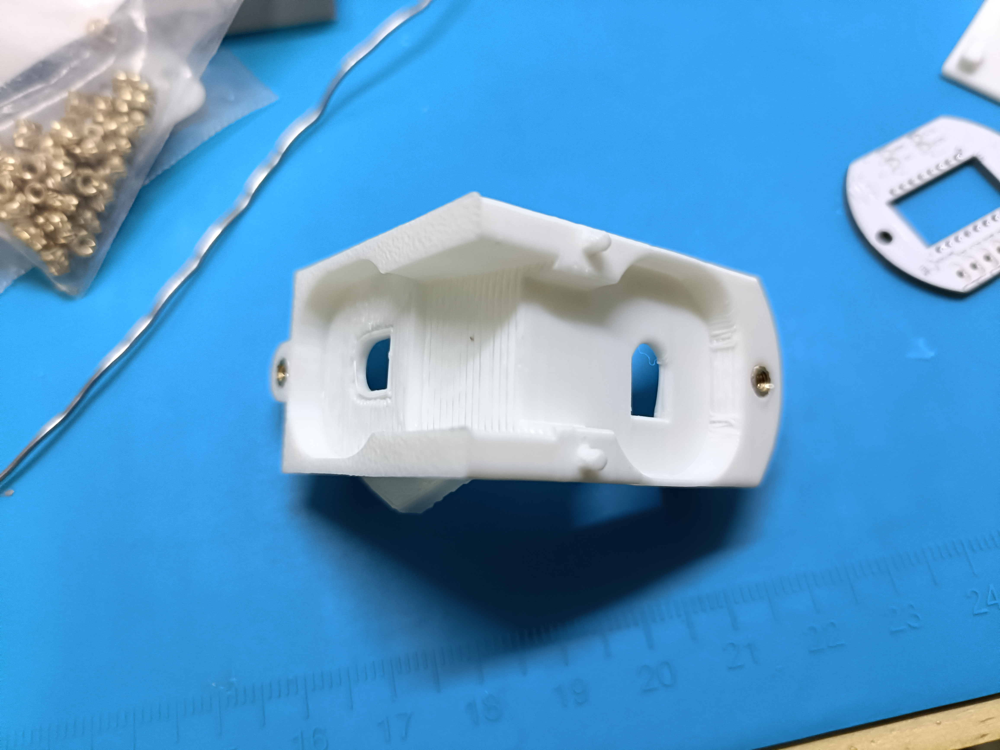  
追加キーパッドモジュール底面部においては次の2箇所にインサートナットを圧入します．  
  
磁石を接着します．
本体底面部において，次の二か所に磁石を接着します．
接着剤を穴の底面と側面に塗布し，磁石を接着します．
この際に，二つの磁石の極が異なるように配置してください．  
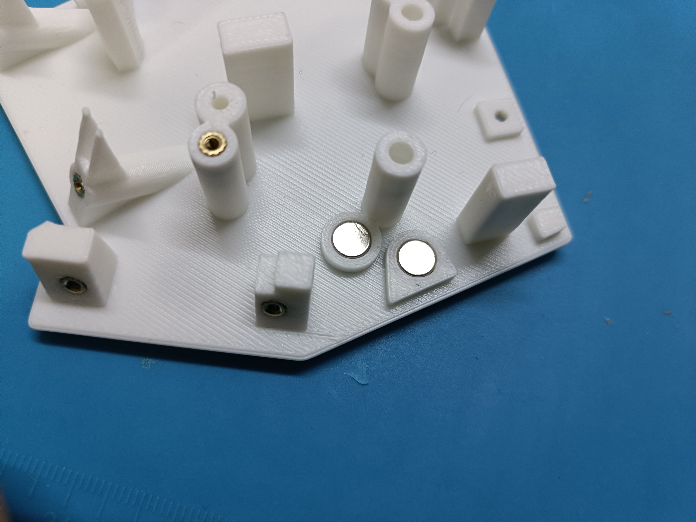  

debugカバーにおいて次の二か所に磁石を接着します．
この際に，本体底面部と引き合う向きで磁石を接着します．
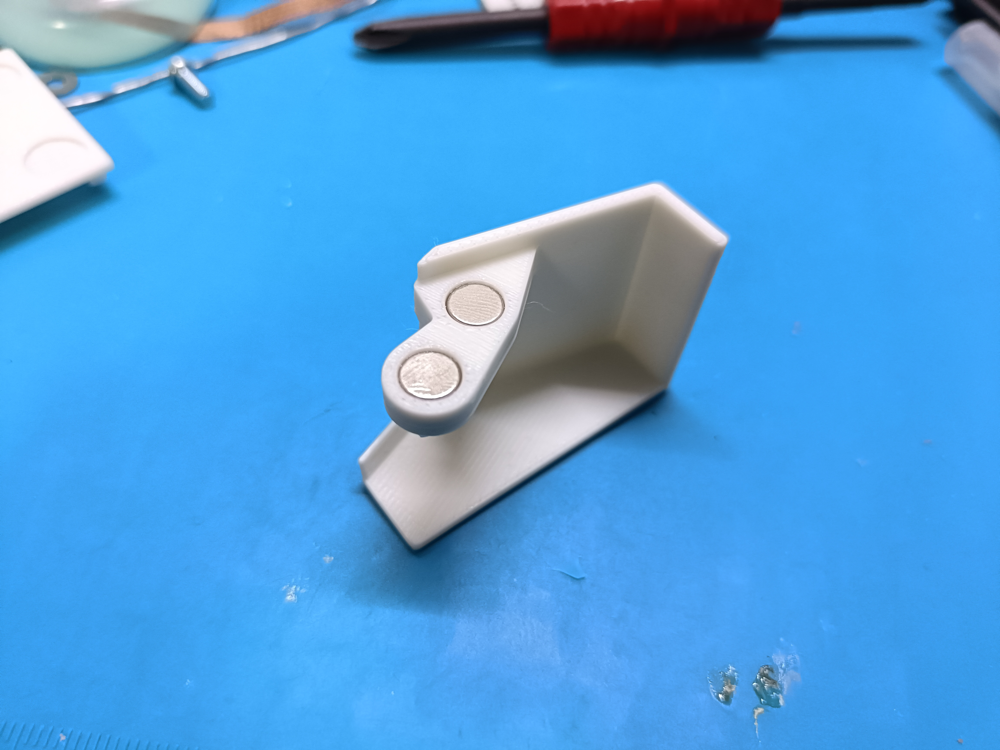

## [基板のはんだ付け]

### [センサモジュール基板]
表面  
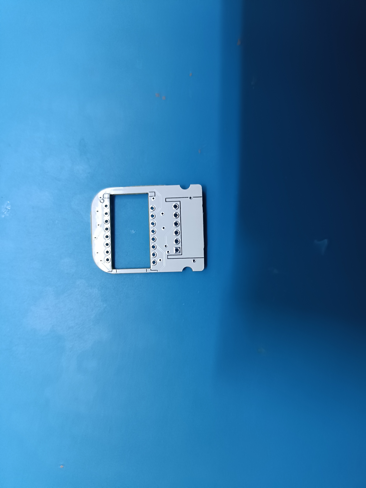  
裏面  
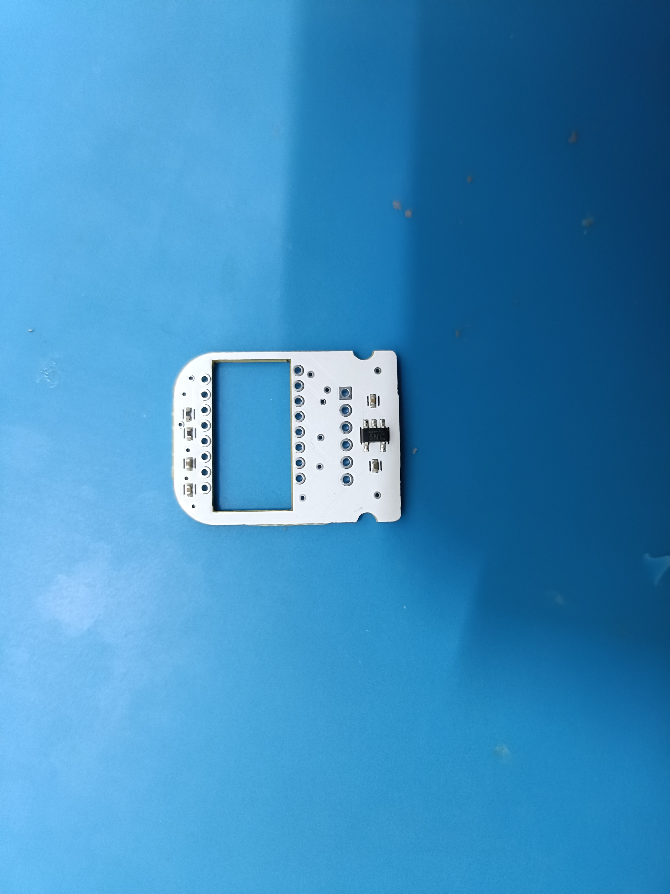  

センサ基板に実装する部品は次の通りです．

| 名前 | 概要 | 数 |
|:-|:-|:-|
| PMW3360 | イメージセンサ | 1 |
| S6B-PH-KL | PHコネクタ ベース付ポスト(サイド型)6極 | 1 |

PMW3360を実装します．向きに注意してください．向きを基板裏面のシンボルに合わせます．裏面からセンサを基板に差し込み，表面ではんだ付けします．  
  
  
次に，コネクタを実装します．
裏面からコネクタを基板に差し込み，表面ではんだ付けします．  
  
PMW3360のレンズを取り付けます．  
センサのカプトンテープを剥がし，レンズをセンサに取り付けます．  
  
センサから飛び出ているガイドポスト二か所を半田ごてで溶かし，レンズを固定します．  
  

### [メイン基板]
表面  
  
裏面  
  

メイン基板に実装する部品は次の通りです．

| 名前 | 概要 | 数 |
|:-|:-|:-|
| PMW3360 | イメージセンサ | 1 |
| SKRPABE010 | 表面実装スイッチ | 2 |
| S6B-PH-KL | PHコネクタ ベース付ポスト(サイド型)6極 | 2 |
| S8B-PH-KL | PHコネクタ ベース付ポスト(サイド型)8極 | 1 |
| B6B-PH-KL | PHコネクタ ベース付ポスト(トップ型)6極 | 1 or 2 |

BootスイッチとResetスイッチを実装します．SKRPABE010を表面に実装します．  
  
次に，PMW3360を実装します．表面で足をはんだ付けします．向きに注意してください．向きを基板裏面のシンボルに合わせます．裏面からセンサを基板に差し込み，表面ではんだ付けします．  
  
  
次に，コネクタを実装していきます．  
初めに，センサモジュールとの接続用のコネクタ(S6B-PH-KL)を実装します. 
表面からコネクタを基板に差し込み，裏面ではんだ付けします．  
  
次に，サイドキーパッドとの接続用のコネクタ(S8B-PH-KL)とOLEDモジュールとの接続コネクタ(S6B-PH-KL)を実装します．裏面からコネクタを基板に差し込み，表面ではんだ付けします．  
  
次に，親指モジュールとの接続用のコネクタ(B6B-PH-KL)を実装します．裏面からコネクタを基板に差し込み，表面ではんだ付けします．  
  
任意でデバッグ用のコネクタを実装します．表面からコネクタを基板に差し込み，裏面ではんだ付けします．  
  

### [サイドキーパッド基板]
表面  
  
裏面  
  

実装する部品は次の通りです．
| 名前 | 概要 | 数 |
|:-|:-|:-|
|| CherryMXスイッチのソケット | 3 |
| sk6812MINI-E | マイコン内蔵フルカラーLED | 3 |
| 1n4148w | 表面実装ダイオード | 3 |

裏面に部品を実装します．
LED,ダイオード，MXソケットを実装します．LED，ダイオード実装の際には向きに注意してください．図のように基板のシルクに合わせて実装します．  
  
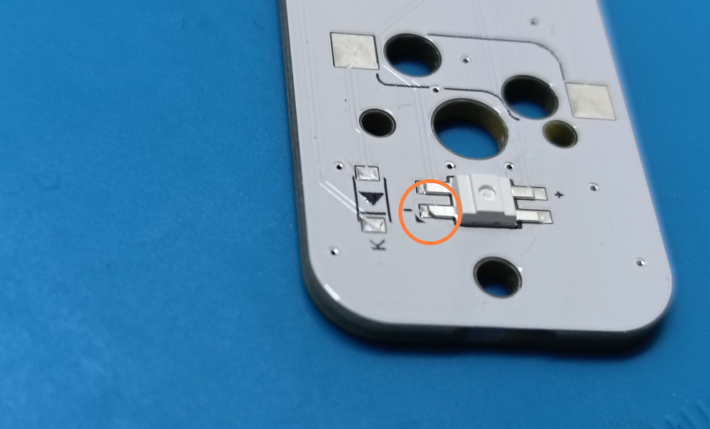  
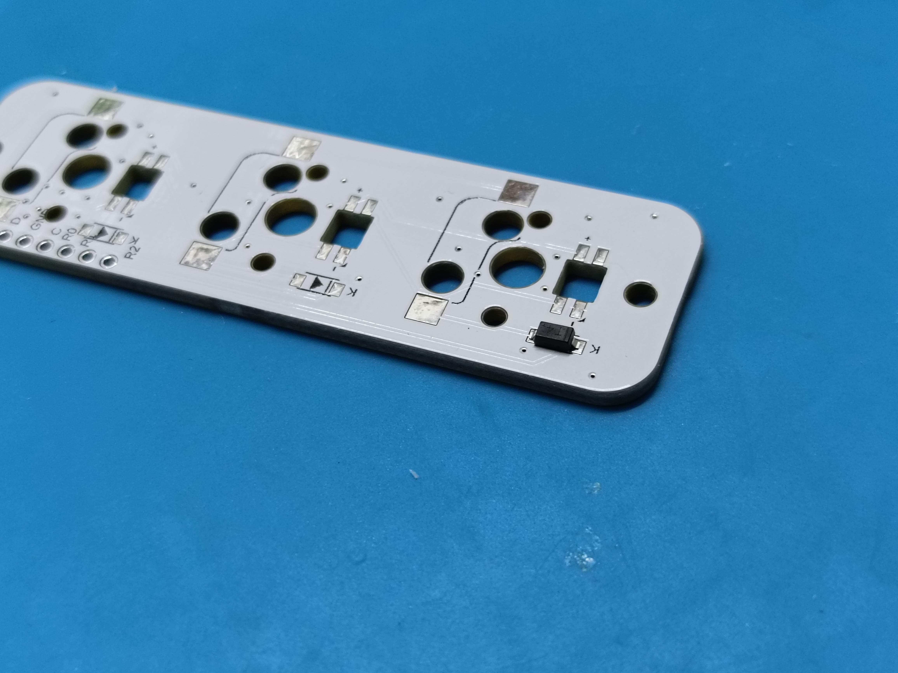  

### [親指モジュール基板]
表面  
  
裏面  
  

実装する部品は次の通りです．
| 名前 | 概要 | 数 |
|:-|:-|:-|
|| Kailh_choc v1スイッチのソケット | 2 |
| sk6812MINI-E | マイコン内蔵フルカラーLED | 2 |
| 1n4148w | 表面実装ダイオード | 2 |
| S6B-PH-KL | PHコネクタ ベース付ポスト(サイド型)6極 | 1 |

裏面に部品を実装します．
LED,ダイオード，chocソケットを実装します．chocソケット，LED，ダイオード実装の際には向きに注意してください．LED,ダイオードは図のように基板のシルクに合わせて実装します．  
chocソケットにも向きがあります．図のように飛び出している部分が外側を向くように実装します．  
  
  
  
  

接続用のコネクタを実装します．裏面からコネクタを基板に差し込み，表面ではんだ付けします．  
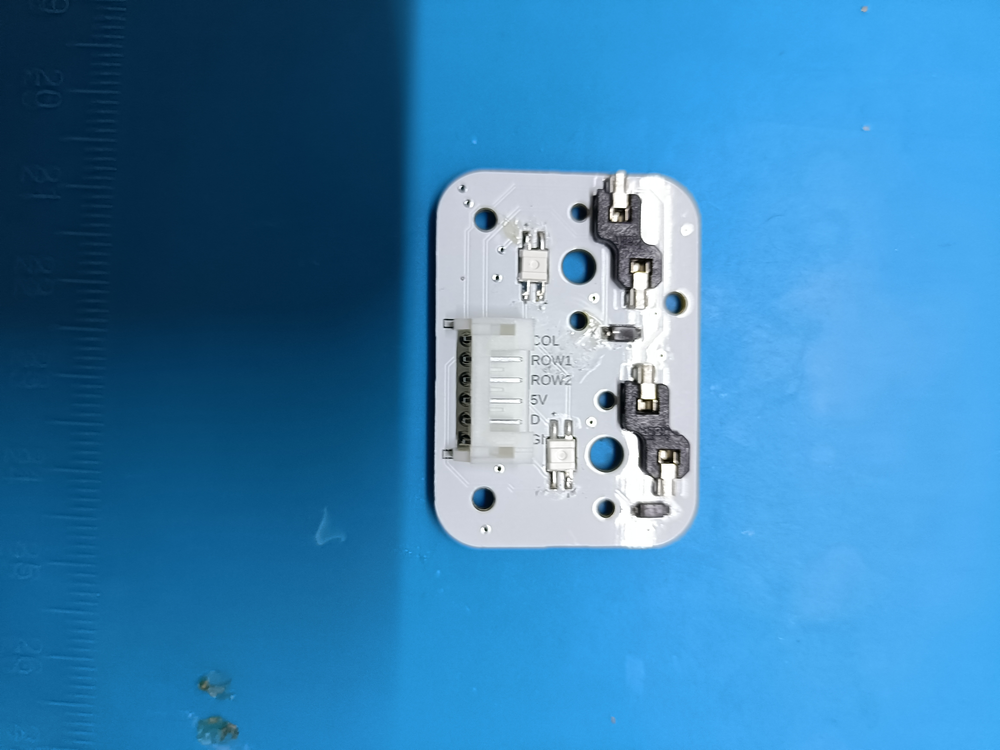  

### [OLEDモジュール基板]
表面  
  
裏面  
  

実装する部品は次の通りです．
| 名前 | 概要 | 数 |
|:-|:-|:-|
| SKRPABE010 | 表面実装スイッチ | 1 |
| OLED | 128x32pixcelのSSD1306登載OLEDモジュール| 1 |
| S6B-PH-KL | PHコネクタ ベース付ポスト(サイド型)6極 | 1 |

表面実装スイッチを表面に実装します．  
  
次に，OLEDを実装します．  
OLEDにピンヘッダをはんだ付けします．  
  
OLEDを基板に差し込みます．任意で基板の裏側から出ているピンヘッダを切断します．  
  
基板の裏側からピンヘッダをはんだ付けします．この際に基板のエッジとOLEDのエッジが平行になるように注意してください．大きくゆがんでいると組み立てた際にOLEDの押し込みができなくなる場合があります．  
  
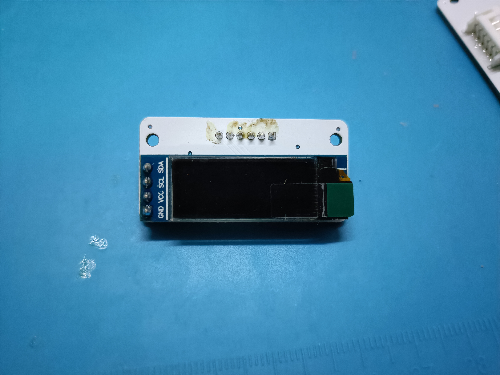  

次に，コネクタを実装します．裏面からコネクタを基板に差し込み，表面ではんだ付けします．  
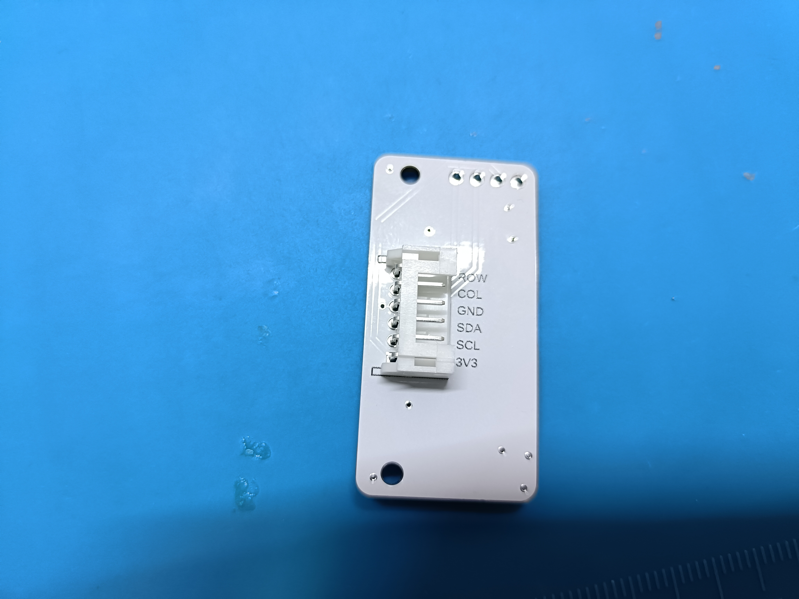  

### [追加キーパッドモジュール基板]
表面  
  
裏面  
  

実装する部品は次の通りです．
| 名前 | 概要 | 数 |
|:-|:-|:-|
|| CherryMXスイッチのソケット | 6 |
| 1n4148w | 表面実装ダイオード | 6 |

裏面に部品を実装します．
ダイオード，MXソケットを実装します．ダイオード実装の際には向きに注意してください．図のように基板のシルクに合わせて実装します．  
  
  

ケーブル4をはんだ付けします．ケーブルの向きに注意してください．ケーブルが外側を向きようにします．また，基板を裏面から見た際にハウジングが見える向きにします．  
  

ケーブルを反対側に折り曲げます．  
  

### [メイン基板とサイドキーパッド基板の接続]
メイン基板とサイドキーパッド基板を接続します．